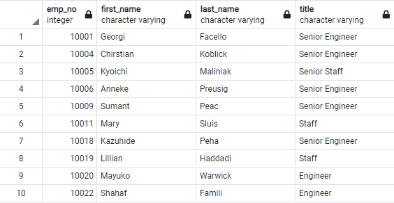
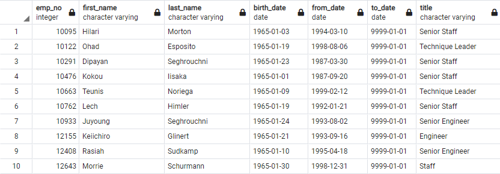
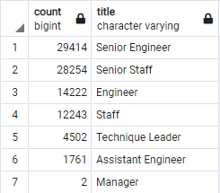
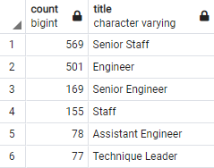
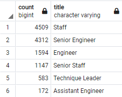

# Pewlett-Hackard-Analysis

## Overview of Analysis
Pewlett Hackard is worried about the "Silver Tsunami" as many of their current employees are reaching retirement age.  We need to anaylize their employee records to determine the number of retiring employees per job title and to identify employees that are eligible to participate in their mentorship program.

## Resources:

Data Source: 
- [retirement_titles.csv](Data/retirement_titles.csv)
- [unique_titles.csv](Data/unique_titles.csv)
- [retiring_titles.csv](Data/retiring_titles.csv)
- [mentorship_eligibilty.csv](Data/mentorship_eligibilty.csv)
- [mentorship_eligibility_inc.csv](Data/mentorship_eligibility_inc.csv)

 
Software: PostgreSQL v13.3, pgAdmin 4 v5.3
 
Code: [Employee_Database_challenge.sql](Queries/Employee_Database_challenge.sql)

## Results: Retirement

- The first query was created to make a Retirement Titles table that holds all the job titles of current employees who were born between January 1, 1952 and December 31, 1955.  It returned a table with 133,776 entries.

- The second query was to created to clean up the previous table.  We can now have a table that conatins every retirment eligible employee at their current job title within Pewlett Hackard.  There are 90,398 employees nearing retirement.

## Results: Mentorship Program

- The last query created was for the Pewlett Hackard Mentorship Program.  We joined 3 databases and filtered the data to find current employees that meet the mentorship eligibility.  Pewlett Hackard has 1549 eligible employees for the program.

## Summary

- The "Silver Tsunami" coming to Pewlett Hackard will have 90,398 employees set to retire in the near future.  Senior Engineer and Senior Staff will be the highest impacted job titles with both having over 28,000 employees ready to retire soon.

- I believe Pewllet Packard needs to increase the qualifications needed to mentor the next generation of employees.  As it stands there are 1549 employees eligible to mentor the next generation of 90,398 employees entering the workforce.  This is less than 1.8% of mentors available for new hires.

- If the qualifications to be included in the Mentorship Program increases by 6 months there will be an extra 10,768 employees that are eligible to participate.  That is an increase of 695%.

