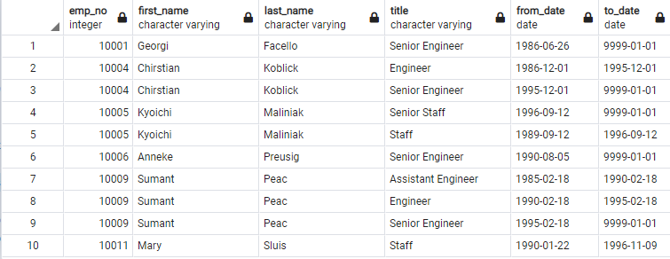

# Pewlett-Hackard-Analysis

## Overview of Analysis
Pewlett Hackard is worried about the "Silver Tsunami" as many of their current employees are reaching retirement age.  We need to anaylize their employee records to determine the number of retiring employees per job title and to identify employees that are eligible to participate in their mentorship program.

## Resources:

Data Source: 
[retirement_titles.csv](Data/retirement_titles.csv), 
[unique_titles.csv](Data/unique_titles.csv), 
[retiring_titles.csv](Data/retiring_titles.csv), 
[mentorship_eligibilty.csv](mentorship_eligibilty.csv)
 
Software: PostgreSQL v13.3, pgAdmin 4 v5.3
 
Code: [Employee_Database_challenge.sql](Queries/Employee_Database_challenge.sql)

## Results Retirement

- The first query was created to make a Retirement Titles table that holds all the job titles of current employees who were born between January 1, 1952 and December 31, 1955.  It returned a table with 133,776 entries.

- The second query was to created to clean up the previous table.  We can now have a table that conatins every retirment eligible employee at their current job title within Pewlett Hackard.  There are 90,398 employees nearing retirement.

- The third query was created to show the amount of retiring employees in each job title.  This allows Pewlett Hackard to see which job titles are going to be affected the most by the "Silver Tsunami" that is coming.  Senior Engineer and Senior Staff will be the highest impacted job titles with both having over 28,000 employees ready to retire soon.

## Results Mentorship Program

- The last query created was for the Pewlett Hackard Mentorship Program.  We joined 3 databases and filtered the data to find current employees that meet the mentorship eligibility.  Pewlett Hackard has 1549 eligible employees for their program.

## Summary

- How many roles will need to be filled as the "silver tsunami" begins to make an impact?

- Are there enough qualified, retirement-ready employees in the departments to mentor the next generation of Pewlett Hackard employees?